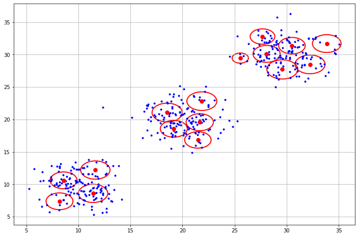
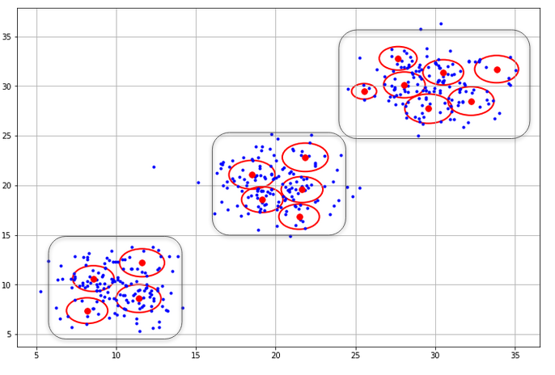

# DenStream clustering

 -- paper "Density-Based Clustering over an Evolving Data Stream with Noise" --

#### On-line stage

Keep track of

- potential micro-cluster
- outlier micro-cluster

When a new streaming point arrives, compute the distance to all "potential micro-cluster":

- if min distance < **ε** , merge with "potential micro-cluster"
- if min distance > **ε** , add this point to "outlier micro-cluster"

#### Off-line stage

Run DBSCAN on "potential micro-cluster": merge close micro-clusters

##### References

[1] Cao, Feng, Martin Estert, Weining Qian, and Aoying Zhou. "Density-based clustering over an evolving data stream with noise." In *Proceedings of the 2006 SIAM international conference on data mining*, pp. 328-339. Society for Industrial and Applied Mathematics, 2006.

[2] https://github.com/issamemari/DenStream 

